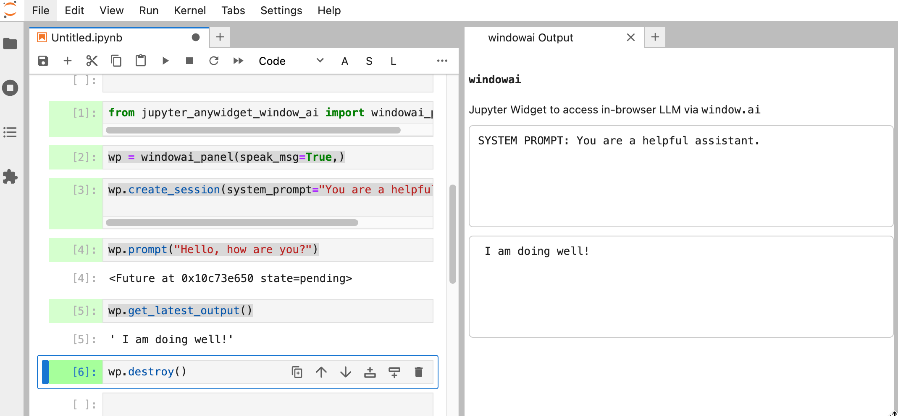

# jupyter_anywidget_window_ai

Example of using `window.ai` in-browser LLM (Chrome Canary) in JupyterLab / Jupyter notebook using `anywidget`.



Set-up Chrome Canary / `window.ai`: [Getting started with window.ai in Chrome Canary — in browser Gemini LLM](https://blog.ouseful.info/2024/09/01/getting-started-with-window-ai-in-chrome-canary-in-browser-gemini-llm/)

We can test the availability of `window.ai` prompt API using some simple javascript magic in a Jupyter notebook accessed via an appropriately configured Chrome Canary browser:

```javascript
%%javascript
// VIEW RESULT IN BROWSER DEV TOOLS CONSOLE

// h/t ChatGPT

(async function() {
     console.log("Creating AI asisstant...\n\n");
 
    // Assuming ai.assistant.create() is defined 
    // and accessible in your environment
    const session = await ai.assistant.create();

    console.log("Session created...\n\n");

    console.log("Sending prompt...\n\n");

    // Prompt the model and wait for the result
    const result = await session.prompt("Write me a poem.");


    // Log the result to the console
    console.log(result);
})();
```

## Installation

```sh
pip install jupyter_anywidget_window_ai
```

## Usage

This runs in a browser based Jupyter environment and uses the browser machinery to run the in-browser LLM application.

Create a widget:

```python
# Import package
from jupyter_anywidget_window_ai import windowai_panel, windowai_inline, windowai_headless

# Create a headless widget
# - works in: Jupyter Lab, Jupyter Notebook, VS Code
w = windowai_headless()

# Inline mode
# Preview output as cell output from initialising cell
# - works in: Jupyter Lab, Jupyter Notebook, VS Code
# w = windowai_inline()

# Create a widget panel with a handle
# - uses jupyter sidecar (Jupyter Lab only)
#w = windowai_panel()
# Close panel either via X or:
#w.close()

```

Get model capabilities: `w.update_capabilities()`. *Note that this may take a moment to update the py state and no callback is currently available. Run the command in its own cell and wait a moment.*

Create a prompt session with an optional system prompt: `w.create_session(system_prompt=PROMPT)`

Submit a prompt: `w.prompt("Hello, how are you?")`

Also available: `w.create_session(..., initialPrompts=[], temperature=FLOAT, topK=INT )`

At the moment, there is no callback available on a response generated from a prompt. However, an audible alert *is* available.

This is enabled by default in `windowai_headless()`. The response can also be spoken. Use boolean (`True`/`False` ) parameters `completion_tone=` and `speak_msg=` in `windowai_panel()`, `windowai_inline()` and `windowai_headless()` to set audible responses.

Get the response text: `w.get_latest_output()`

Destroy the session: `w.destroy()`

See `window.ai.assistant` docs for more examples that should translate: [Google explainer: *prompt-api*](https://github.com/explainers-by-googlers/prompt-api)

## TO DO

- add `autosession` flag to allow session to be automatically configured and created when a widget is instantiated;
- add support for other APIs ([`explainers-by-googlers/writing-assistance-apis`](https://github.com/explainers-by-googlers/writing-assistance-apis))

## ELSEWHERE

See other examples of running "sideloaded" WASM apps using Jupyter `anywidget` models

- PGLite (PostgreSQL) wasm — in-browser database: [`jupyter_anywidget_pglite`](https://github.com/innovationOUtside/jupyter_anywidget_pglite)
- Tesseract/pdfjs — in-browser OCR: [`jupyter_anywidget_tesseract_pdfjs`](https://github.com/innovationOUtside/jupyter_anywidget_tesseract_pdfjs)
- Graphviz — in-browser graphviz diagrams from `.dot` code: [`jupyter_anywidget_graphviz`](https://github.com/innovationOUtside/jupyter_anywidget_graphviz)
